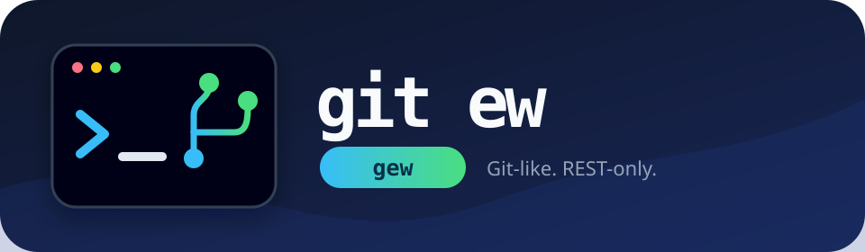

# git ew ("gew")

<p align="center">
  
</p>

**git ew**, invoked as `gew`, is a Git-like, REST-only workspace client for
Gitea. It is made for environments where the normal `git` executable or Git
transport cannot be used, but HTTPS access to Gitea's API is available.

Version 0.2 added a real local staging area and local commit queue. Staged file
content is snapshotted, so editing a file after `gew add` does not silently alter
the commit. Each local commit is pushed to Gitea separately, in order, with its
own message.

Version 0.3 adds a three-way merge engine to `pull`. It automatically combines
non-overlapping text edits, creates standard conflict markers for overlapping
edits, preserves binary conflict sides, and supports merge continue/abort.

`gew` is not a reimplementation of Git's object database. It does not support
rebase, cherry-pick, tags, submodules, or arbitrary historical checkouts.

## A quick sample

```sh
# Download a repository through the Gitea REST API — no .git directory.
gew clone acme/widgets
cd widgets

# Make a change, stage its exact contents, and create a local queued commit.
printf '\nREST all the things.\n' >> README.md
gew add README.md
gew diff --staged
gew commit -m "Document the REST workflow"

# Merge any newer changes from main, then publish your queued commit.
gew pull
gew push
```

If `pull` finds overlapping changes, resolve the marked files and finish with
`gew merge --continue -m "Resolve merge"`, or return to the exact pre-merge
workspace with `gew merge --abort`.

## Build

Go 1.22 or newer is required. There are no third-party dependencies.

```sh
go test ./...
go build -o gew .
./gew version
```

## Configure

Create a Gitea personal access token with repository read/write permission. Use
an environment variable during login to keep the token out of the process
argument list:

```sh
export GEW_TOKEN=your-token
./gew login https://gitea.example.com
unset GEW_TOKEN
./gew doctor
```

The saved token lives in the operating system's user configuration directory
with file mode `0600`. For an ephemeral environment, skip `login` and provide
both `GEW_SERVER` and `GEW_TOKEN` when running commands.

## Git-like workflow

```sh
# Clone an existing or empty repository. No .git directory is created.
./gew clone acme/widgets
cd widgets

# Edit files, inspect the working tree, and stage selected paths.
gew status
gew diff
gew add src/config.go README.md

# Inspect exactly what is staged, then create a local commit.
gew diff --staged
gew commit -m "Update widget configuration"

# Create more local commits if desired, inspect them, then push in order.
gew log --oneline
gew push

# Safely download a newer remote snapshot.
gew pull
```

If local and remote files both changed, `pull` performs a three-way merge using
the last synchronized commit as the base. For a conflict:

```sh
# Inspect files containing <<<<<<< ours / ======= / >>>>>>> theirs.
gew status

# Edit each conflicted file, then continue with a local merge commit.
gew merge --continue -m "Resolve merge conflicts"

# Or restore the exact pre-merge workspace and local commit queue.
gew merge --abort
```

Binary conflict versions are preserved under `.gew/conflicts/` with `.base`,
`.ours`, and `.theirs` suffixes. Choose or replace the working file before
continuing.

Use `gew pull --ff-only` when automation must refuse all local merges.

To stage all created, modified, and deleted files:

```sh
gew add -A
```

To unstage one path or the entire index without changing working files:

```sh
gew reset src/config.go
gew reset
```

To create and switch the workspace to a new remote branch while pushing queued
commits:

```sh
gew push --new-branch feature/config
```

Commands work from any subdirectory because `gew` searches parent directories
for `.gew/state.json`. Path arguments are interpreted relative to the current
directory, like Git pathspecs.

## Command mapping

| Git | gew |
| --- | --- |
| `git clone URL` | `gew clone OWNER/REPO` |
| `git status` | `gew status` |
| `git diff` | `gew diff` |
| `git diff --staged` | `gew diff --staged` |
| `git add PATH` | `gew add PATH` |
| `git add -A` | `gew add -A` |
| `git reset PATH` | `gew reset PATH` |
| `git commit -m MSG` | `gew commit -m MSG` |
| `git log --oneline` | `gew log --oneline` |
| `git push` | `gew push` |
| `git pull` | `gew pull` |
| `git pull --ff-only` | `gew pull --ff-only` |
| `git merge --continue` | `gew merge --continue` |
| `git merge --abort` | `gew merge --abort` |

## Local model

`gew` keeps private metadata under `.gew/`:

```text
.gew/
  state.json       workspace, branch, remote base, queue, local history
  index.json       currently staged paths
  objects/         immutable staged and baseline file snapshots
  commits/         local commit records and remote push results
  merge.json       recoverable in-progress merge state
  conflicts/       binary base/ours/theirs files during conflicts
```

The local flow is:

```text
working files -> gew add -> staging index -> gew commit -> local queue -> gew push -> Gitea
```

The `.gew` directory and any `.git` directory are excluded from status, staging,
and pushes. Tokens are never written into a workspace.

## Safety behavior

- `pull` refuses staged changes. Unstaged changes are merged when the remote has
  advanced. Additional unstaged changes on top of queued commits must be
  committed or restored first.
- Non-overlapping text edits merge automatically. Conflicting edits receive
  diff3-style base/ours/theirs markers.
- `merge --abort` restores the exact pre-merge files, state, queue, and an empty
  staging index.
- When remote changes overlap queued local commits, successful pulls replace the
  queue with one synthetic merge commit. Superseded commits remain visible in
  `gew log`.
- `push` refuses when the remote branch has advanced since clone or pull.
- Existing remote files are updated or deleted using their current blob SHA.
- A partially successful multi-commit push is checkpointed after each remote
  commit. Retrying continues with the remaining queue.
- Archive extraction rejects path traversal and symbolic links.
- Staging rejects paths outside the workspace and internal `.gew`/`.git` paths.
- Empty repositories are supported; the first push creates the initial branch
  and commit.

## Gitea compatibility

Push uses the atomic multi-file endpoint:

```text
POST /api/v1/repos/{owner}/{repo}/contents
```

Your instance's `swagger.v1.json` should contain the operation
`repoChangeFiles`. Clone and pull also require the repository archive, branch,
and recursive tree endpoints.

## Current limitations

- The merge engine is line-oriented. It does not perform semantic language-aware
  merges or rename detection.
- Synthetic merge commits are linear Gitea commits because the REST contents API
  cannot create a native two-parent Git merge commit.
- `log` shows commits created locally by this `gew` workspace. It is not a full
  remote-history browser.
- Symbolic links, submodules, executable-bit-only changes, and empty directories
  are not tracked.
- Renames are represented as delete plus create.
- Large repositories are downloaded as complete ZIP snapshots.
- The diff engine is line-oriented and intentionally simpler than Git's diff.
